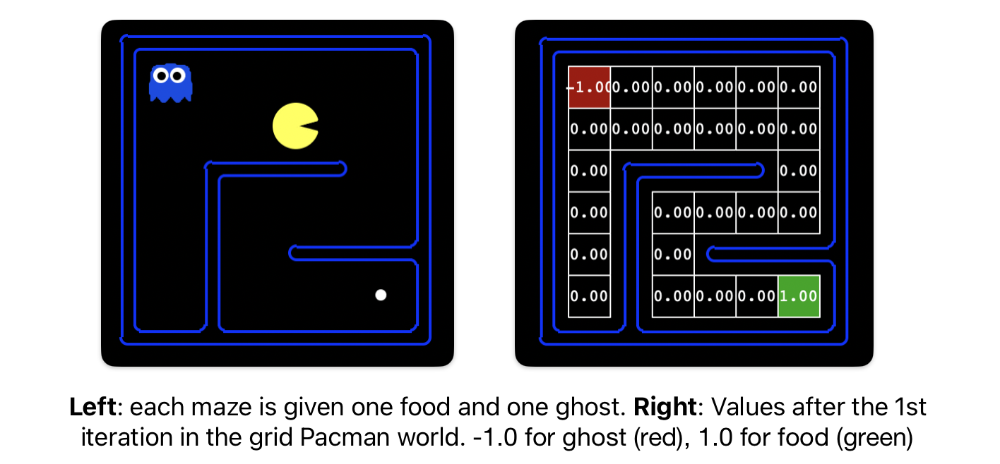


<div class="alert alert-info">
You can download the materials for this assignment here:
<ul>

<li><a href="{{page.materials}}">code</a></li>

</ul>
</div>


---

# HW 0: Search and Value Iteration (100pts)

<div class="container-fluid">
<div class="row"><div class="col-lg-6" >

</div></div></div>

### Introduction

In this assignment, your Pacman agent will find paths through his maze world, both to reach a particular location and to collect food efficiently. You will build general search algorithms and apply them to Pacman scenarios.

The code for HW 0 consists of several Python files [here]({{page.materials}}), some of which you will need to read and understand in order to complete the assignment, and some of which you can ignore.


| Files you'll edit:         | Description                                                                 |
|----------------------------|-----------------------------------------------------------------------------|
| `search.py`                | Where all of your search algorithms will reside.                           |
| `valueIterationAgents.py`          | A value iteration agent for solving known MDPs.                         |

| Files you might want to look at: | Description                                                                 |
|----------------------------------|-----------------------------------------------------------------------------|
| `searchAgents.py`          | Where all of your search-based agents will reside.                         |
| `pacman.py`                     | The main file that runs Pacman games. This file describes a Pacman GameState type, which you use in this project. |
| `game.py`                       | The logic behind how the Pacman world works. This file describes several supporting types like AgentState, Agent, Direction, and Grid. |
| `mdp.py`                       | Defines methods on general MDPs.                  |
| `util.py`                       | Useful data structures for implementing search algorithms.                  |

| Supporting files you can ignore: | Description                                                                 |
|-----------------------------------|-----------------------------------------------------------------------------|
| `graphicsDisplay.py`            | Graphics for Pacman                                                        |
| `graphicsUtils.py`              | Support for Pacman graphics                                                |
| `textDisplay.py`                | ASCII graphics for Pacman                                                  |
| `ghostAgents.py`                | Agents to control ghosts                                                   |
| `keyboardAgents.py`             | Keyboard interfaces to control Pacman                                      |
| `layout.py`                     | Code for reading layout files and storing their contents                   |
| `autograder.py`                 | Project autograder                                                         |
| `testParser.py`                 | Parses autograder test and solution files                                  |
| `testClasses.py`                | General autograding test classes                                           |
| `test_cases/`                   | Directory containing the test cases for each question                      |
| `HW0TestClasses.py`          | HW0 specific autograding test classes                                |


Files to Edit and Submit: You will fill in portions of `search.py` and `valueIterationAgents.py` during the assignment. You should submit these files with your code and comments. Please do not change the other files in this distribution or submit any of our original files other than these files.

**Evaluation**: Your code will be autograded for technical correctness. Please do not change the names of any provided functions or classes within the code, or you will wreak havoc on the autograder. However, the correctness of your implementation -- not the autograder's judgements -- will be the final judge of your score. If necessary, we will review and grade assignments individually to ensure that you receive due credit for your work.

**Academic Dishonesty**: We will be checking your code against other submissions in the class for logical redundancy. If you copy someone else's code and submit it with minor changes, we will know. These cheat detectors are quite hard to fool, so please don't try. We trust you all to submit your own work only; please don't let us down. If you do, we will pursue the strongest consequences available to us.

### Grading

HW0 includes an autograder for you to grade your answers on your machine. You can run it using the following command:
```
python autograder.py
```

This command grades your solution to all problems in HW 0 and shows the results of that question's tests, the questions grade, and a final summary at the end. The command of autograder for each question is provded in each section.

### Welcome

After `git clone` and changing to the directory `homeworks/hw0`, you should be able to play a game of Pacman by typing the following at the command line:
```
python pacman.py
```
Pacman lives in a shiny blue world of twisting corridors and tasty round treats. Navigating this world efficiently will be Pacman's first step in mastering his domain.

The simplest agent in `searchAgents.py` is called the `GoWestAgent`, which always goes West (a trivial reflex agent). This agent can occasionally win:

```
python pacman.py --layout testMaze --pacman GoWestAgent
```
But, things get ugly for this agent when turning is required:

```
python pacman.py --layout tinyMaze --pacman GoWestAgent
```
If Pacman gets stuck, you can exit the game by typing CTRL-c into your terminal.

Soon, your agent will solve not only `tinyMaze`, but any maze you want.

Note that `pacman.py` supports a number of options that can each be expressed in a long way (e.g., `--layout`) or a short way (e.g., `-l`). You can see the list of all options and their default values via:
```
python pacman.py -h
```

### Q1 (20 points): Finding a Fixed Food Dot using Depth First Search

In `searchAgents.py`, you'll find a fully implemented `SearchAgent`, which plans out a path through Pacman's world and then executes that path step-by-step. The search algorithms (in `search.py`) for formulating a plan are not implemented -- that's your job.

First, test that the `SearchAgent` is working correctly by running:
```
python pacman.py -l tinyMaze -p SearchAgent -a fn=tinyMazeSearch
```
The command above tells the `SearchAgent` to use `tinyMazeSearch` as its search algorithm, which is implemented in `search.py`. Pacman should navigate the maze successfully.

Now it's time to write full-fledged generic search functions to help Pacman plan routes! You may refer to pseudocodes for search algorithms available online. Remember that a search node must contain not only a state but also the information necessary to reconstruct the path (plan) which gets to that state.

**Important note**: All of your search functions need to return *a list of actions* that will lead the agent from the start to the goal. These actions all have to be legal moves (valid directions, no moving through walls).

**Important note**: Make sure to use the `Stack`, `Queue` and `PriorityQueue` data structures provided to you in `util.py`! These data structure implementations have particular properties which are required for compatibility with the autograder.

*Hint*: Each algorithm is very similar. Algorithms for DFS, BFS, UCS, and A* differ only in the details of how the fringe is managed. So, concentrate on getting DFS right and the rest should be relatively straightforward. Indeed, one possible implementation requires only a single generic search method which is configured with an algorithm-specific queuing strategy. (Your implementation need *not* be of this form to receive full credit).

TO DO: Implement the depth-first search (DFS) algorithm in the `depthFirstSearch` function in `search.py`. To make your algorithm complete, write the graph search version of DFS, which avoids expanding any already visited states.

Your code should quickly find a solution for:
```
python pacman.py -l tinyMaze -p SearchAgent
python pacman.py -l mediumMaze -p SearchAgent
python pacman.py -l bigMaze -z .5 -p SearchAgent
```
The Pacman board will show an overlay of the states explored, and the order in which they were explored (brighter red means earlier exploration). Is the exploration order what you would have expected? Does Pacman actually go to all the explored squares on his way to the goal?

Hint: If you use a `Stack` as your data structure, the solution found by your DFS algorithm for `mediumMaze` should have a length of 130 (provided you push successors onto the fringe in the order provided by getSuccessors; you might get 246 if you push them in the reverse order). Is this a least cost solution? If not, think about what depth-first search is doing wrong.

*Grading*: Please run the below command to see if your implementation passes all the autograder test cases.
```
python autograder.py -q q1
```

### Q2 (20 points): Breadth First Search

TO DO: Implement the breadth-first search (BFS) algorithm in the `breadthFirstSearch` function in `search.py`. Again, write a graph search algorithm that avoids expanding any already visited states. Test your code the same way you did for depth-first search.

```
python pacman.py -l mediumMaze -p SearchAgent -a fn=bfs
python pacman.py -l bigMaze -p SearchAgent -a fn=bfs -z .5
```
Does BFS find a least cost solution? If not, check your implementation.

*Hint*: If Pacman moves too slowly for you, try the option --frameTime 0.

*Note*: (Optional; this is not a part of credit) If you've written your search code generically, your code should work equally well for the eight-puzzle search problem without any changes.

python eightpuzzle.py

*Grading*: Please run the below command to see if your implementation passes all the autograder test cases.

```
python autograder.py -q q2
```

### Q3 (20 points): Varying the Cost Function (Uniform Cost Search)

While BFS will find a fewest-actions path to the goal, we might want to find paths that are "best" in other senses. Consider `mediumDottedMaze` and `mediumScaryMaze`.

By changing the cost function, we can encourage Pacman to find different paths. For example, we can charge more for dangerous steps in ghost-ridden areas or less for steps in food-rich areas, and a rational Pacman agent should adjust its behavior in response.

TO DO: Implement the uniform-cost graph search algorithm in the `uniformCostSearch` function in `search.py`. We encourage you to look through `util.py` for some data structures that may be useful in your implementation. You should now observe successful behavior in all three of the following layouts, where the agents below are all UCS (Uniform Cost Search) agents that differ only in the cost function they use (the agents and cost functions are written for you):

```
python pacman.py -l mediumMaze -p SearchAgent -a fn=ucs
python pacman.py -l mediumDottedMaze -p StayEastSearchAgent
python pacman.py -l mediumScaryMaze -p StayWestSearchAgent
```

*Note*: You should get very low and very high path costs for the `StayEastSearchAgent` and `StayWestSearchAgent` respectively, due to their exponential cost functions (see `searchAgents.py` for details).

Grading: Please run the below command to see if your implementation passes all the autograder test cases.
```
python autograder.py -q q3
```

### Q4 (20 points): A* Search

TO DO: Implement A* graph search in the empty function `aStarSearch` in `search.py`. A* takes a heuristic function as an argument. Heuristics take two arguments: a state in the search problem (the main argument), and the problem itself (for reference information). The `nullHeuristic` heuristic function in `search.py` is a trivial example.

You can test your A* implementation on the original problem of finding a path through a maze to a fixed position using the Manhattan distance heuristic (implemented already as `manhattanHeuristic` in `searchAgents.py`).
```
python pacman.py -l bigMaze -z .5 -p SearchAgent -a fn=astar,heuristic=manhattanHeuristic
```
You should see that A* finds the optimal solution slightly faster than uniform cost search (about 549 vs. 620 search nodes expanded in our implementation, but ties in priority may make your numbers differ slightly). What happens on openMaze for the various search strategies?

Grading: Please run the below command to see if your implementation passes all the autograder test cases.
```
python autograder.py -q q4
```

### Q5 (20 points): Value Iteration

Value Iteration computes the value function $V_k(s)$ for each state $s$, which represents the maximum expected reward achievable starting from that state. The value update equation is:

<div class="container-fluid">
<div class="row"><div class="col-lg-6" >

</div></div></div>

Write a value iteration agent in `ValueIterationAgent`, which has been partially specified for you in `valueIterationAgents.py`. Your value iteration agent is an offline planner in the Pacman grid world, with (x, y) coordinates. The MDP (Markov Decision Process) state is the exact board configuration facing Pacman (see `PacmanMDP` class in `valueIterationAgents.py`).

<div class="container-fluid">
<div class="row"><div class="col-lg-6" >

</div></div></div>

`ValueIterationAgent` takes an MDP on construction and runs value iteration for the specified number of iterations before the constructor returns (see the `__init__` function of `ValueIterationAgent`).

Value iteration computes k-step estimates of the optimal values, $V_k(s)$. In addition to running value iteration (`runValueIteration`), implement the following methods for `ValueIterationAgent` using $V_k$:

* `computeActionFromValues(state)` computes the best action according to the value function given by self.values.
* `computeQValueFromValues(state, action)` returns the Q-value of the (state, action) pair given by the value function given by self.values.

*Important*: Use the "batch" version of value iteration where each vector $V_k$ is computed from a fixed vector $V_{k-1}$, not the "online" (or "in place") version where one single weight vector is updated in place. This means that you would have to use two arrays, one for the old values, $V_{k-1}$, and one
for the new values, $V_k$. When a state's value is updated in iteration k based on the values of its successor states, the successor state values used in the value update computation should be those from iteration k-1 (even if some of the successor states had already been updated in iteration k). The difference is discussed in [Sutton & Barto](http://incompleteideas.net/book/the-book-2nd.html) in the 6th paragraph of chapter 4.1.


*Note*: Make sure to handle the case when a state has no available actions in an MDP (think about what this means for future rewards).

To test your implementation, run the autograder:

```
python autograder.py -q q5
```

The following command loads your ValueIterationAgent, which will run value iteration with 100 iterations.
```
python pacman.py -l tinySimple -p ValueIterationAgent -i 100
```

Hint: On the tinySimple layout, running value iteration for 10 iterations should give you this output:

<div class="container-fluid">
<div class="row">
<div class="col-lg-6" >

</div></div></div>

# Submission
Submissions should be done on [Gradescope](https://www.gradescope.com).
You need to submit **2** files to Gradescope: "HW 0".

- `search.py`
- `valueIterationAgents.py`

HW 0 will be automatically graded by the Gradescope system. The score displayed immediately after submission will be your final score.


### Acknowledgment
This assignment incorporates many elements from the CS 188 course materials developed at UC Berkeley.
