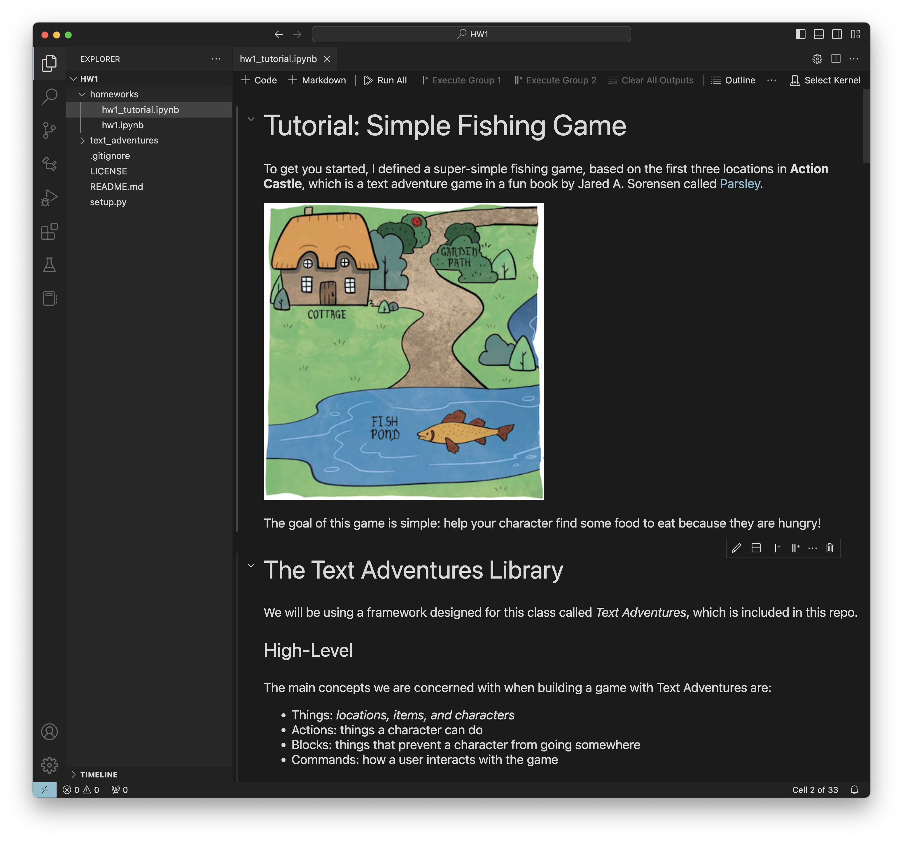
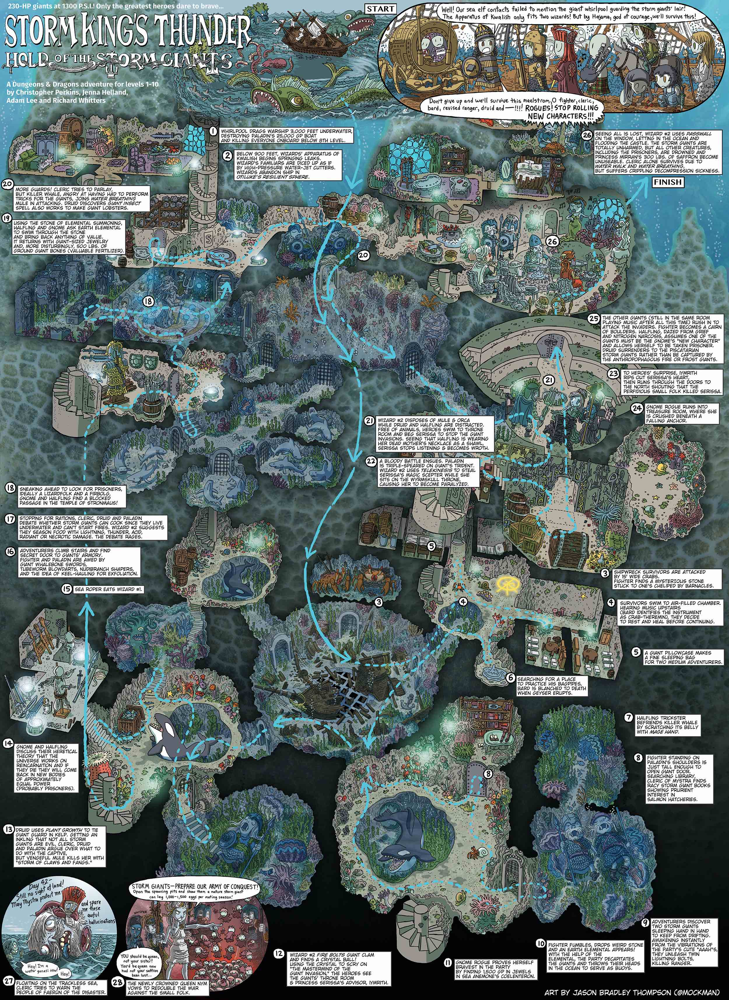
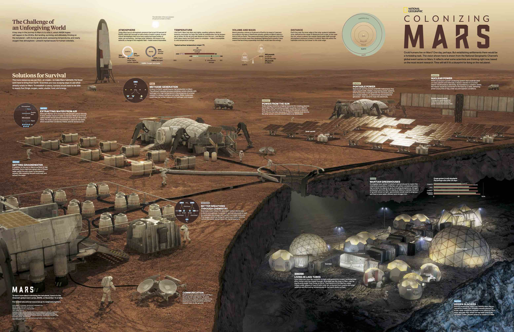


<div class="alert alert-info">
You can download the materials for this assignment here:
<ul>

<li><a href="{{item.url}}">{{ item.name }}</a></li>

</ul>
</div>


## Instructions

In this homework assignment, you will write your own classic text adventure game. You will implement two text adventure games.  One will be a re-implementation of the __Action Castle__ game, and one will be a game that you design yourself. The game that you design can be on any topic, or can tell any story of your choice.  We will play the games that you design during class, and part of your grade will be awarded based on how creative/exciting your classmates think your game is.

### Using our Starter code

We have provided [starter code for a basic text adventure game]({{page.materials[0].url}}).  I recommend using Visual Studio Code for this homework.

#### Environment Setup

First download the zip file (or `git clone https://github.com/pearls-lab/intro-deep-rl-course.git`), then create a virtual environment and install
the dependencies.

```
$ unzip hw1.zip
$ cd part-1-textgame
$ python3 -mvenv venv
$ source venv/bin/activate
(venv) $ pip install -r requirements.txt
```

#### VSCode

We recommend that you use VSCode.
The best way to ensure a good experience with VSCode is to launch it from the
project directory with your virtual environment already enabled.

```
$ cd path/to/homework/HW1/
$ source venv/bin/activate
(venv) $ code .
```

If the `code` command does not work, open VSCode's command pallet (command+shift+p)
and type `shell command`. VSCode should then show an option for installing
'code' in your PATH.


#### Try out the Tutorial

After you have downloaded the code, started your virutal envionment and launched VSCode, you should work through the `HW1_Tutorial.ipynb` notebook that we created to show off the basics of our text adventure game platform.  Here's a screenshot of the notebook that you'll see.

<div class="container-fluid">
  <div class="row">
<div class="col-lg-6" >
<a href="tutorial-screenshot.png"></a>
</div>
</div>
</div>


### Visualizition module

Our starter code includes a vizualize tool `text_adventure_games.viz` which will allow you to view your game map as a directed graph.  To use this, you will also need to install graphviz. There is both the graphviz app and the graphviz python library, which is a wrapper for the app. You can find instructions on how to install graphviz from their website here: [graphviz.org/download/](https://graphviz.org/download/)


### Task 1: Implement Action Castle (20pt)

Action Castle is a game by Jared A. Sorensen.  It is included in his book [Parsley](http://www.memento-mori.com/pdf/parsely-pdf), which is a collection of games inspired by the text-adventures of the 1980s.  Parsley is a party game where you take on the role of the parser, and the players shout out commands like GO NORTH, LIGHT LAMP or GET SWORD.  You obtusely follow player's commands, simulating a computer's limited vocabulary.  The effect is suprisingly hilarious and fun. 

You should download ["Parsely: Preview n' Play Edition"](http://www.memento-mori.com/pdf/parsely-preview-n-play-edition) which is free on Jared's website.  It contains the Action Castle game that you'll be implementing.  You can also [buy the full Parsley book for $20](http://www.memento-mori.com/pdf/parsely-pdf) if you'd like to support an awesome indy game developer.  The Preview n' Play Edition also explains how these kinds of games work.

We have implemented most of Action Castle for you. 
1. We created the 13 locations from Action Castle (Cottage, Garden Path, Fishing Pond, Winding Path, Top of the Tall Tree, Drawbridge, Courtyard, Tower Stairs, Tower, 
Dungeon Stairs, Dungeon, Great Feasting Hall, Throne Room).
2. We created most of the items for the game (fishing poll, rosebush, club, fish, the troll etc.).
You will need to update the code so that it can:
3. Add blocks to the game (these are puzzles that the player needs to solve in order to make progress).  You should add blocks in
* The courtyard - the guard prevents you from going east
* The dungeon stairs - the darkness prevents you from going down
* The tower stairs - the locked door prevents you from going up
4. Add special actions for the Action Castle game.  You should add Actions for:
* Unlocking the door
* Reading the runes to banish the ghost from the dungeon
* Proposing marriage
* Sitting on the throne


<div class="alert alert-warning" markdown="1">
__Need a hint on how to get started?__ Check out the `Troll_Block` class to see an example of how to implement a Block, and the `Eat` class as an example of how to implement an Action.   
</div>


<div class="alert alert-warning" markdown="1">
__Want to know how to win the game?__ Here's a sequence of actions that should result in a winning state, if you've implemented the game correctly. You can play through the full Action Castle game with the following commands:
`take pole, go out, go south, catch fish with pole, go north, pick rose, smell rose, go north, go up, get branch, go down, go east, give the troll the fish, go east, hit guard with branch, get key, go east, get candle, go west, go down, light lamp, go down, light candle, read runes, get crown, go up, go up, go up, unlock door, go up, give rose to the princess, propose to the princess, wear crown, down, down, east, east, sit on throne`
</div>


### Task 2: Implement Your Own Creation (20pt)

Your game should include all of the following:

* At least 3 Locations
* At least 3 Items that can be interacted with. These can be doors, keys, tools, ogres, etc.
* At least one "puzzle" where there are certain preconditions that must be met before the player can make forward progress.  This could be an Action or a Block.
* At least one "win" state and at least one "lose" state.

A fun example of a tiny game with very 3 locations and 3 items is the "Flaming Goat" game in Jared A. Sorensen's [Parsley book](http://www.memento-mori.com/pdf/parsely-pdf).

Optionally, you can think about adding other elements to your game, like:
* Scoring
* Changes over time
* Interesting non-player characters

Feel free to modify the starter code (`Text_Adventure_Game.ipynb`) in any way you see fit in order to enable your game ideas. However, the "Play the game" and "Visualize your game" code blocks should remain functional.

What kind of game should you make?  It's up to you! Be creative! For inspiration, we recommend searching Pinterest for cross-section maps.  Here are some that we like:

<div class="container-fluid">
  <div class="row">
<div class="col-lg-4 col-md-6 col-xs-12" style="margin-bottom: 20px; height: 350px;">
<a href="inspiration/lighthouse.jpg"></a>
</div>
<div class="col-lg-4 col-md-6 col-xs-12" style="margin-bottom: 20px; height: 350px;">
<a href="inspiration/treehouse.jpg"></a>
</div>
<div class="col-lg-4 col-md-6 col-xs-12" style="margin-bottom: 20px; height: 350px;">
<a href="inspiration/storm-king.jpg"></a>
</div>
<div class="col-lg-4 col-md-6 col-xs-12" style="margin-bottom: 20px; height: 350px;">
<a href="inspiration/mars.pdf"></a>
</div>
  </div>
</div>


<div class="alert alert-warning" markdown="1">
__Tip:__ I recommend drawing out on your game on [graph paper](http://print-graph-paper.com/) before you get started.
</div>


<!-- ## Extensions

If your team has more than 2 members, you should implement one extension per team member beyond 2.  Here are some ideas:

* Write code to export our Python classes into the [Adventuron format](https://adventuron.io/) so that they can be compiled and played on itch.io.
* Create a web server for running the games.  
* Convert the game into a multiplayer game.
* Create Item subclasses that can act as containers and surfaces, and add Actions for "put in" and "put on".  For example, a bottle can contain wine or a table could have items on it.
* Incorporate time into the game.  For instance, in Action Castle, there is a rule that says:
>  Each turn spent in the Dungeon causes the ghost to drift closer and closer. If not defeated within three turns, the ghost reaches out a skeletal hand and drains the player’s life force.
* Implement hit points and combat.  At the moment our Attack action immediately knocks the victim out, without giving them a chance to fight back.
* Add random tables to your game, similar to the tables that are found in the Labyrinth game.
* Add magic to the game, allowing for wizards who can cast spells.

Other extensions are possible.  Run your extension ideas by us on Ed Stem.

For some extensions, you may need to modify the base code.  That's fine!  You can submit a zip file with the full package.  -->

## Submission

Submissions should be done on [Gradescope]({{page.submission_link}}).

1. Submit an IPython notebook called `action_castle.ipynb` that runs Action Castle to "HW 1 - Part 1 Action Castle". This assignment will be automatically graded.

2. Submit 4 files to "HW 1 - Part 1 My game"
- An IPython notebook called `my_game.ipynb` that runs the initial version of your game.
- A text file called `playthrough.txt` with all of the commands that we need to issue to complete your game. It should be a plain text file with one command per line.
- A text file called `README.md` containing a short paragraph describing your game, and why you picked that topic.
- An image (game-visualization.jpg or pdf) showing the directed graph for your game. 

Do not zip or compress your files! Submit them as individual files.


## Grading
<div class="alert alert-warning" markdown="1">
* Implement Action Castle - 20 points
* Implement Your Own Creation - 20 points
</div>

 
## Recommended readings

* {{ reading.authors }}, <a href="{{ reading.url }}">{{ reading.title }}</a>.  <i>{{ reading.note }}</i>


